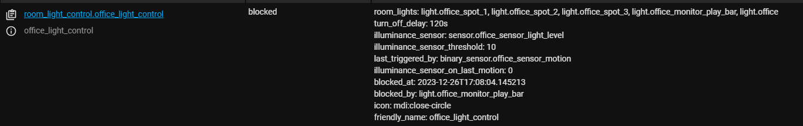
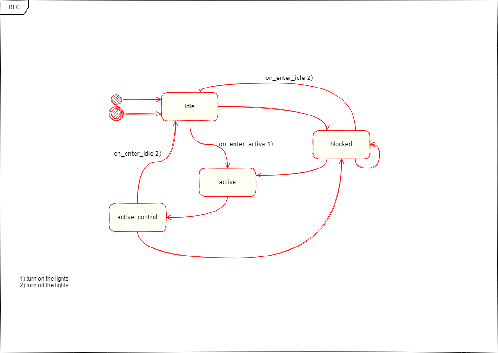

# Room Light Control

Room Light Control is a home-assistant integration designed to automatically control the lights in a specific room of your house. 
Using a combination of sensors and logic, the automation creates a natural and convenient experience when you enter and exit the room.

## Features

- Automated control of lights in a specific room
- Support for human presence sensors like Aqara FP1 (mmwave sensors)
- Lights triggered by motion or occupancy sensors
- Lights turn off based on a timer or occupancy sensor
- Timer restarts when motion is detected again
- Turning on the lights can be constrained by an illuminance sensor
- Manual interference pauses auto-control WHEN
  - ... lights are already on
  - ... a scene is activated while auto-control is running (e.g. Philips Hue Scene turned on with your Smartphone)
- Lights can be blocked from turning off by a configurable entity
- Easy Configuration with auto-discovery based on a room akka area

## Installation

To install Room Light Control, simply copy all files from the `room_light_control` directory to your Home Assistant's `/custom_components/room_light_control` directory, using the Raw button to ensure proper formatting. Then, restart Home Assistant.

## Configuration

Configuring Room Light Control is straightforward thanks to its auto-discovery feature that detects lights based on a room or area.

To enable this integration, add the following lines to your `configuration.yaml` file:

```yaml
# Example configuration.yaml entry
room_light_control:
```

### Minimum sensor/entity requirements:

- an area, which represents your room (e.g. office)
- one motion sensor
- a light

This integration is build all around rooms, so first you need to configure an area for each of your rooms and assign the light's and sensor to the corresponding area.

### Configuration variables
| Property name | Description | Default value |
| --- | --- | --- |
| `room` | The name of the room, corresponding to the area name. |  |
| `motion_sensor` | A list of motion sensors used to trigger the lights. On/Off Sensor, when state changes from off to on scene/script configured in 'turn_on_light' is triggered |  |
| `illuminance_sensor` | A sensor used to measure the illuminance in the room. (Optional) |  |
| `illuminance_sensor_threshold` | The threshold illuminance value for the lights to turn on. (Optional) | `5.0` |
| `turn_on_light` | The script or scene used to turn on the lights. |  |
| `turn_off_light` | Turn off the lights by script instead of default method which turns off every single light automatically (Optional) |  |
| `turn_off_delay` | The time delay (in seconds) before turning off the lights after no motion is detected. Acts also as a timeout for the turn_off_sensor, if it is configured. (Optional) | `180` |
| `turn_off_sensor` | A sensor used to detect when a person has left the room. On/Off Sensor, when state changes from on to off lights will be turned off. (Optional) |  |
| `turn_off_blocking_entity` | An entity that, when active, prevents the lights from turning off. (Optional) |  |


**Example Configurations:**

a) The lights will turn on when motion is detected and the lights will turn off after 30 seconds of no motion. To turn on the lights you can either use a scene or a script.
```yaml
- floor_light_control:
    room: floor
    motion_sensor: binary_sensor.floor_motion_sensor
    turn_off_delay: 30 
    turn_on_light: scene.floor_bright
```

b) You can also use multiple motion sensors to trigger the light. An illuminance sensor can prevent the lights from turning on when there is enough natural light in the room.

```yaml
- bedroom_light_control:
    room: bedroom
    motion_sensor: 
      - binary_sensor.bedroom_left_motion_sensor
      - binary_sensor.bedroom_right_motion_sensor
    illuminance_sensor: sensor.bedroom_light_level
    illuminance_sensor_threshold: 5
    turn_off_delay: 90
    turn_on_light: script.bedroom_activate_light
```

c) Multiple rooms are also supported. This configuration enables automatic light control in a combined living area that includes a kitchen.
```yaml
- living_light_control:
    room: 
      - livingroom
      - kitchen
    motion_sensor: 
      - binary_sensor.living_room_motion_sensor
      - binary_sensor.kitchen_motion_sensor
    illuminance_sensor: sensor.livingroom_light_level
    illuminance_sensor_threshold: 5.0            
    turn_off_delay: 120           
    turn_on_light: scene.living_area_default
```

d) Using a human presence sensor like the Aqara FP1. The lights will turn on when motion is detected and will turn off when a human presence sensor like the Aqara FP1 detects that the person has left the room. This is an alternative to using a timer to turn off the lights.
```yaml
- bath_light_control:
    room: bath
    motion_sensor: 
      - binary_sensor.bath_ground_motion_sensor # PIR motion sensor
      - binary_sensor.bath_occupancy # mmwave motion sensor
    turn_off_sensor:
      - binary_sensor.bath_occupancy # mmwave motion sensor
    turn_on_light: script.bath_activate_light 
```

## Debugging

If you encounter issues with Room Light Control, here are some steps and tools to help you troubleshoot and resolve them:

### Current state

You find all relevant attributes under Developer Tools->States. Here you can also see which light's have been dynamically scanned.


The state of RLC transistions as following:


### Enable Detailed Logging
To get detailed logs from your Room Light Control integration, you can increase the logging level in Home Assistant. Add the following to your `configuration.yaml` file under the `logger` component:

```yaml
logger:
  default: warning
  logs:
    custom_components.room_light_control: debug
```

## Contributing

Please read [CONTRIBUTING.md](.github/CONTRIBUTING.md) and the process for submitting issues.

## License

Room Light Control is licensed under the [GNU GENERAL PUBLIC LICENSE](LICENSE).

## Credits

Special credits goes to Daniel Mason, the creator of [entity-controller](https://github.com/danobot/entity-controller) from which I got inspired and used his code base as starting point for this integration.
